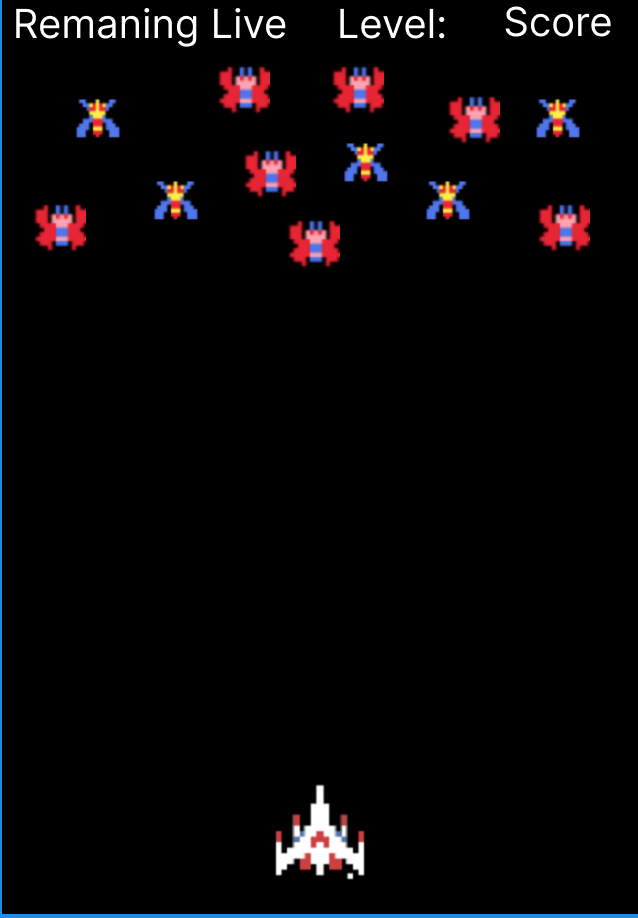
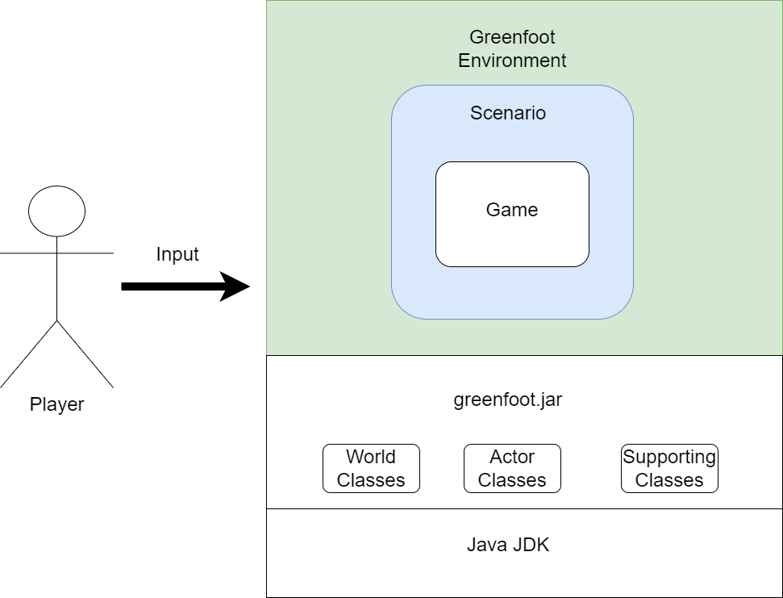
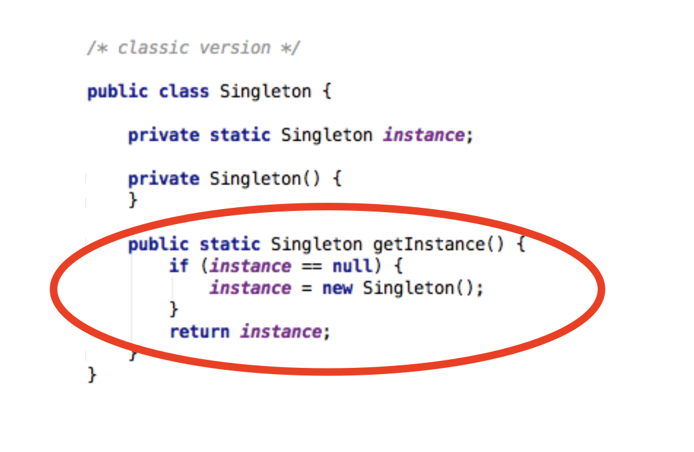
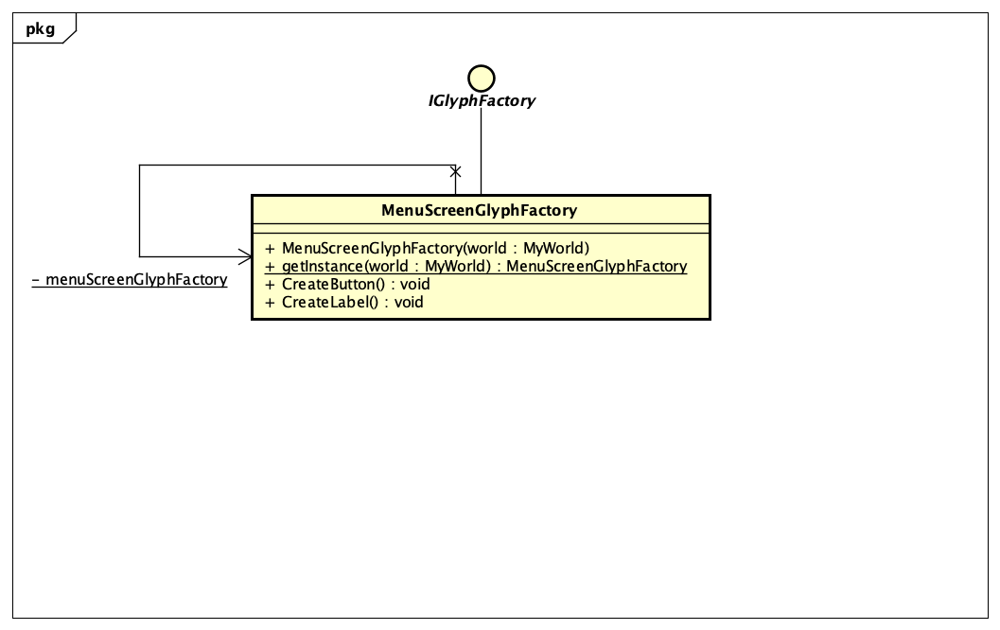

# Fantastic Four - Space Shooter Game Modification

## Team members

| Name        | XP Core Value |
| ----------- | ------------- |
| Yikang Chen | Feedback      |
| Jianle Li   | Communication |
| Ray Sheng   | Respect       |
| Yiyang Yin  | Courage       |

## About the project
### Description 
Space Invaders of 1978 pioneered a genre of video games that gave rise to a vast lineage of games over the past 40+ years. The original subgenre of space shooter games had very simple gameplay due to the technical limitations of their time. The player typically takes control of a fighter jet in space and shoots down alien invaders. The player-controlled fighter moves left and right to aim at incoming enemies and dodge enemy attacks, shooting a single projectile straight ahead. The simplicity of this type of games made it an ideal model for students to replicate as a beginner's tutorial in game development and computer programming in general.

For our project, we took an open-source [simplified Galaga clone](https://www.greenfoot.org/scenarios/25287) made with Greenfoot, updated it with new gameplay features and brought it into the glorious new world of the 1990s.

### Feature Set
- Support player level up gameplay
- Support player special effects such as shield and powerup
- Support player heart pickup mechanism
- Automatic level upgrade 
- Automatic buff objects release and interactice logic
- Monster traverse path is optimized and expended

### How to run this project
- Option 1: Playing [online]()
- Option 2:
  * Install [Greenfoot](https://www.greenfoot.org/download)
  * Clone this [repository](https://github.com/nguyensjsu/fa22-202-fantastic-four)
  * Run `project.greenfoot` inside the src folder

## Project videos
12/3 meeting
* [User Story Video](https://youtu.be/yFqlWyShiAo)
* [Project Demo Video]()
* [Stand-up meeting]()
* [Retrospective meeting]()

## Project architecture
### UI Wireframes
* Start Screen
  * 
* Game Screen
  * 
* Game Over Screen
  * 

### High level diagrams
#### Architecture Diagram

## Key feature designs
### Yikang Chen

I use the **Strategy Design Pattern** to implement the **different ways of attack**. With the game score increasing, the LeftLaser and the RightLaser will appear, and they will emit rays in different directions.

### Jianle Li
* In this project, I am primarily responsible for functions pertaining to enemies and have mostly enhanced three features:
  1) The enemies' appearances has transitioned from a `one-time appearance` to a `steady appearance`.
  2) The enemies will select its way of movement at random toward to player. It can choose three different movement methods, which are: `Stay still(default)`, `Move Vertically Down` and `Move Toward The Player`. (Strategy pattern is in used here.)
    * `Strategy Pattern `
      * For each movement method (or algorithm), we use a separate class for encapsulation. These algorithms are also interchangeable. So it is very suitable to use strategy pattern. This pattern makes the program very scalable. If we suddenly want to add a new movement method, we only need to add a new class.
      * Class Diagram for this will be show as following：
  3) Refactoring enemies lives implementation. Allowing enemies to `upgrade its level` (More lives)  (Decorator pattern is in used here.)
    * `Decorator Pattern`
      * The original enemy, whether it is Goei or Zako, has a health value of 1 and will disappear after being hit by a laser.
        In order to strengthen/extend the functions related to enemy life, we use the decorator pattern to divide the enemy into three levels:`Normal Enemy One Life`, `Elite Enemies Two Lives` and `Boss multiple lives`.
      * In different stages of the game, there will be different levels of enemies. That is to say, when creating an enemy object, use different life decorators to decorate the enemy object.
        Use `EnemyOneLifeDecorator` for normal enemies, `EnemyTwoLifeDecorator` for elite enemies, and `EnemyThreeLifeDecorator` for bosses.
      * Class Diagram for this will be show as following：
  4) By reading the current score of the player, the monster may be upgraded further (an upgraded version realized by the third features above).
    1) Each 500/1000 score is separated into several interval. Each interval has a unique assortment of enemies. The number of enemies at each interval grows, as does their speed.
    2) Before reaching a specific score, the boss will not emerge.

### Ray Sheng
#### Power-up Items and Effects
Enemies may drop power-up items upon death. Drop rates, randomization, and the specific method that adds power-up objects into the game world are handled by a Singleton LootManager object. Singleton Pattern does not count towards project grading but it is still a useful design pattern to apply, because this way we can easily adjust drop rates by modifying only the LootManager class instead of having to go into each enemy class.

To keep track of which power-up effect is active at any given time, we applied the State pattern to manage the `Fighter` object's power-up state.

##### State Class Diagram

##### State Transition Table

#### Secondary Attacks
The player-controlled fighter now has the ability to launch a secondary attack besides the vanilla basic attack. When the player-controlled fighter picks up a "Fire Support" power-up item, it gains the temporary ability to launch a corresponding secondary attack by pressing the "D" key.

Secondary Attack modes are managed by using a Strategy pattern. The "D" key calls the `Fighter.fireSupport()` method, which in turn calls the `boom()` method of the current Fire Support Strategy object, thereby applying different effects to the game world depending on which secodary attack mode is employed at the time.

In this particular application of the Strategy Pattern, instead of using an interface to represent the abstract strategy, we used a parent class that also doubles as the default strategy class with which secondary fire is not active.

Currently, only 2 different secondary attack types are implemented. Due to the use of the Strategy Pattern, more varieties of secondary attacks can be easily added in a modular way.

##### Strategy Class Diagram
 Strategies')

#### Healing and Shielding

In the base game, the player-controlled fighter can only lose lives and cannot gain lives. We implemented a simple healing feature that allows it to gain lives. No design pattern was required for this simple feature.

However, the life-loss mechanism had to be refactored to accommodate the shielding feature, with which the player-controlled fighter can gain a temporary shield (upon picking up the corresponding power-up) that negates all incoming damage. 

Previously, upon being hit by a missile or enemy object, the `bombed()` method within the `Fighter` object directly decrements its `lives` field. We refactored this mechanism to pass the life-loss handling to a chain of responsibility that consists of a `Shield` object and a `Hull` object encapsulated within the `Fighter` object. This allows the shielding mechanism a chance to intercept the message that would otherwise result in the player-controlled fighter's losing a life.

##### Chain of Responsibility Class Diagram

##### Damage-Handling Chain

In the scope of this project, the damage-handling Chain of Responsibility only consists of 2 components: `Shield` and `Hull`. If `Shield` is active, an the empty `Shield.takeHit()` method does nothing and stops the message; otherwise, responsibility is passed to `Hull.takeHit()`, which decrements the `Fighter.lives` field.

With only 2 components, it might seem a little contrived to implement a Chain of Responsibility to do the damage-handling. However, the advantage of doing it like this opens up the code for extension if other damage-handling features were to be added in the future. For example, we might want to add a deflector that bounces enemy projectiles back at the enemy, or an absorber that heals the fighter instead of damaging it. To add these featres, we can simply add new `IDamageTarget` objects to appropriate places in the chain.

### Yiyang Yin

#### Singleton Pattern

##### Factories as singletons

There is a 1 on 1 relationship for glyph factories to their designated screens. Therefore, we can create such factories as singletons, making sure that only one copy of such factory is in charge of glyphs on a specific page.
In this project, MenuScreenGlyphFactory and GameOverScreenGlyphFactory are both implemented as singletons. They are invoked by using getInstance method and can only be accessed this way, no real constructor is provided.

You can see a clear interpretation of singleton design in the following portion of our code:

An example view into the class diagram for singleton pattern in our project:

#### Abstract Factory Pattern
The factory method is used to create item objects (button, label) for Menu Screen and Game Screen.
* AbstractFactory(IGlyphFactory): This is the interface as the fundation of all concreate factories in this project. It regulates the methods needed in a factory.
* ConcreteFactory(MenuScreenGlyphFactory, GameOverScreenGlyphFactory): implements the factory method to create the concrete products for specific screen. In this case, the screens are considered different clients, they come in to the factories and ask for different products containing different parts. Buttons and labels can be created and assembled in customized ways in the different factories and eventually shipped to screens with independent responsibility and feature.
* AbstractProduct (Button, Label): declares an interface for a type of product object.
* ConcreteProduct (for example: startButton, tryAgainButton, screenTitle): These are the components that can be customized and added to a specific screen. Note that although some buttons in different screens have similar functionality, they are not the same object and are created rather by different concrete factories.
* Client(screens): uses a set of related products created in ConcreteFactory and doesn’t need to know how these products are created.
To see the details of our abstract and concrete factories, please read the class diagram below:

## Project backlog and chart
* Sprint Task Sheet
* Burn down chart
* Weekly Scrum Task Board
   * Early (Week 1)
  
   * Mid (Week 2,3)
  
   * Late (Week 4)
  

## Individual Contributions and team journals
### Contributions

* Yikang Chen
  1. Implemented the logic of gaining EXP and level-up
  2. Design the logic of different ways of attack with strategy desgin pattern
  3. Implement LaserLeft and LaserRight
  4. Complete testing

* Jianle Li
  1) Provide potential project alternatives at the beginning of the project.
  2) A variety of movement techniques have been added to the game's opponents, allowing them to strike vertically downwards or follow the player's plane to accomplish their assault objective.
  3) The game's initial concept of a single enemy life has been updated by using the decorator pattern, so that various opponent levels would emerge at different game phases.
* Ray Sheng
  1) Researched potential project candidates and suggested project source code  
  2) Added Powerup Items to the game for enemies to drop on death that the player can pick up for advanced effects
  3) Introduced some variety to gameplay in the form of secondary attacks that can be performed by the player-controlled fighter
  4) Added healing and shielding mechanisms to the game to improve player survivability and extending play session time

* Yiyang Yin

### Journals
- Yikang Chen - [Member Journal](/individual_journals/yikang_chen_journal.md)
- Jianle Li - [Member Journal](/individual_journals/jianle_li_journal.md)
- Ray Sheng - [Member Journal](/individual_journals/ray_sheng_journal.md)
- Yiyang Yin - [Member Journal](/individual_journals/yiyang_yin_journal.md)